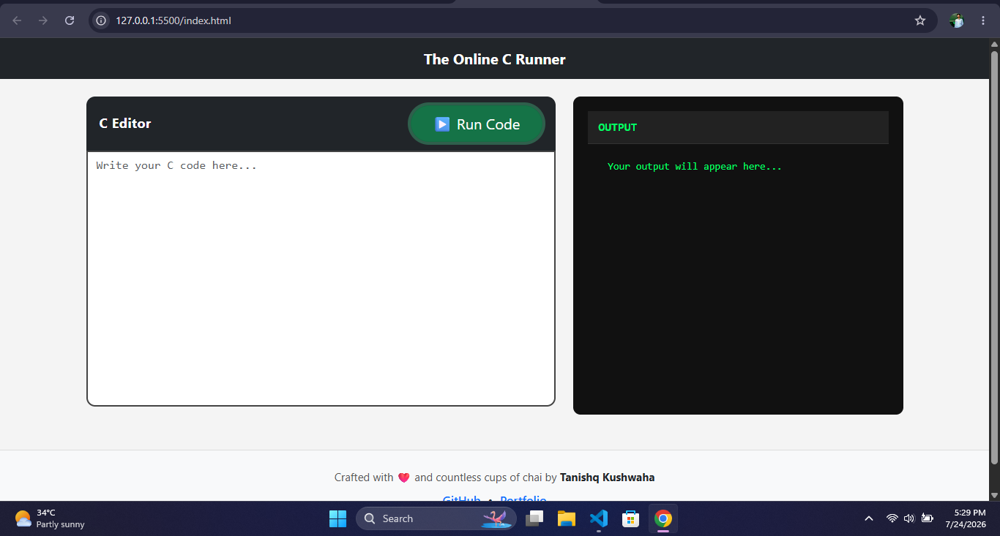
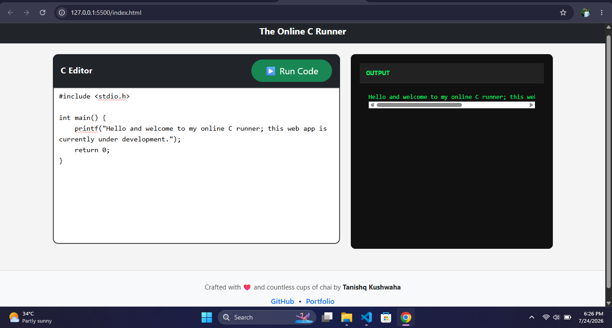

# 🚀 The Online C Runner

A modern, responsive **Online C Compiler** built using **HTML, CSS, Bootstrap, and Vanilla JavaScript**. This project allows users to write, compile, and execute C programs directly in the browser using the **Wandbox API**.


---

## 📌 Features

* 🖥️ Clean & Modern UI
* 📱 Fully Responsive Design
* ⚡ Compile & Run C Programs
* 📤 Real-time Output Terminal
* 🎯 Input (stdin) Support
* ❌ Compiler Error Display
* 🔄 Loading State while Compiling
* 🎨 Bootstrap + Custom CSS
* 🌐 API Integration using Wandbox

---

## 📸 Preview

> 
> 

```
assets/
│
├── home.png
└── output.png
```

---

## 🛠️ Tech Stack

* HTML5
* CSS3
* Bootstrap 5
* Vanilla JavaScript
* Wandbox API

---

## 📂 Project Structure

```text
The-Online-C-Runner
│
├── index.html
│
├── css/
│   └── style.css
│
├── js/
│   └── script.js
│
├── assets/
│
└── README.md
```

---

## 🚀 Getting Started

### Clone Repository

```bash
git clone https://github.com/your-github-username/the-online-c-runner.git
```

### Open Project

Simply open **index.html** in your browser.

No installation required.

---

## 💻 Example Program

```c
#include <stdio.h>

int main()
{
    printf("Hello, World!");
    return 0;
}
```

Output

```text
Hello, World!
```

---

## 📖 Future Improvements

* Monaco Editor
* Syntax Highlighting
* Themes (Dark / Light)
* Download Source Code
* Copy Output
* Multiple Language Support
* Backend Integration (Node.js + Express)
* Self-hosted Compiler Support

---

## 🤝 Contributing

Contributions are welcome!

If you'd like to improve this project:

1. Fork the repository
2. Create a new branch
3. Commit your changes
4. Open a Pull Request

---

## 👨‍💻 Developer

**Tanishq Kushwaha**

* GitHub: https://github.com/your-github-username
* Portfolio: https://your-portfolio-link.com

---

## ⭐ Support

If you found this project helpful, consider giving it a ⭐ on GitHub.

It motivates me to build more open-source projects.

---

## 📄 License

This project is licensed under the **MIT License**.
